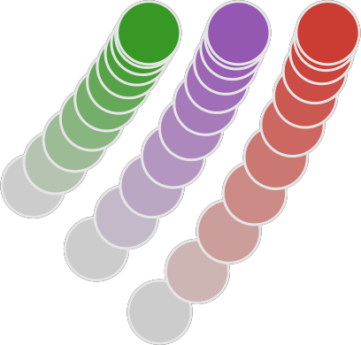

# </img> PointCloudRegistration.jl

**This package is work in progress and not published to the General Registry
of Julia packages yet.**

[](https://a5s.codeberg.page/PointCloudRegistration.jl/)

<video src="PointCloudRegistration/raw/branch/main/examples/animations/register-julia-logo.mp4" type="video/mp4" width="600" height="400" controls>
</video>

**PointCloudRegistration** is a Julia package for registering two point clouds.
This is also known as aligning or superimposing.

Given two point clouds `source` and `target`, this package can perform
* **rigid registration**, i.e. rotate and translate `source` such that it
  matches `target`, or
* **non-rigid registration**, i.e. shift the points in `source` individually but
  coherently to match `target`.

The animation above shows first a rigid and then a non-rigid registration of the
blue and green point clouds.

## Feature overview

* **Rigid registration** (via Kabsch, Iterative Closest Point, optimising the
  Geman-McClure loss, the Kernel Correlation, or the Mean Absolute Deviation)
* **Non-rigid registration** (via Coherent Point Drift, Neighbor Distance
  Preservation, Divergence Free registration, Optimal Transport)
* **Thinning** of point clouds (to a specified number or resolution)
* Conversion from **density arrays** (such as images, cryo-EM volumes)

The package handles 2D, 3D and any higher dimensional point clouds, as well as
point clouds with varyingly weighted points.

## Quickstart

```julia
julia> ]

pkg> add PointCloudRegistration

julia> using PointCloudRegistration

julia> source = [ 1.0 2.3 0.4 7.5
                  0.0 1.6 8.3 4.2 ]
2×4 Matrix{Float64}:
 1.0  2.3  0.4  7.5
 0.0  1.6  8.3  4.2

julia> target = [ 5.8 3.7 4.6 0.0 2.2
                  6.1 2.5 4.8 3.5 1.8 ]
2×5 Matrix{Float64}:
 5.8  3.7  4.6  0.0  2.2
 6.1  2.5  4.8  3.5  1.8

julia> transformation = rigid_registration(source, target)
AffineMap([0.9562894108822751 -0.292421891510248; 0.29242189151024794 0.9562894108822753], [0.9889581453816962, 0.9702886675687052])

julia> transformation.linear
2×2 RotMatrix2{Float64} with indices SOneTo(2)×SOneTo(2):
 0.956289  -0.292422
 0.292422   0.956289

julia> transformation.translation
2-element StaticArraysCore.SVector{2, Float64} with indices SOneTo(2):
 0.9889581453816962
 0.9702886675687052
```
